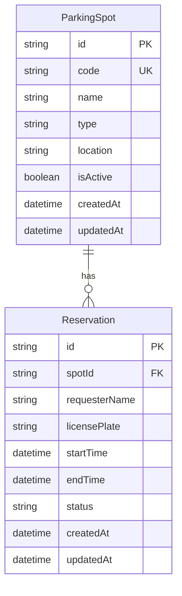

# Parkolóhely-foglalási Rendszer - Rendszerterv

## 1. Áttekintés és Architektúra

A rendszer egy rétegzett RESTful architektúrára épülő backend alkalmazás, amely egy beépített interaktív Web Dashboard-ot és OpenAPI/Swagger felületet is szolgáltat.

### Főbb architekturális rétegek:
1. **Presentation Layer (Megjelenítési réteg):**
   - Single Page Web UI (HTML5, Vanilla CSS glassmorphism dizájn, Aszinkron REST API JS kommunikáció).
   - Swagger UI interaktív API dokumentáció (`/api-docs`).
2. **Controller Layer (Végpont-kezelő réteg):**
   - Express.js routerek és kontrollerek (`spotController`, `reservationController`).
   - Kérés/válasz validáció, HTTP státuszkódok közvetítése (400, 404, 409, 500).
3. **Service Layer (Üzleti logikai réteg):**
   - Foglalási ütközésvizsgálat (`ReservationService`), tranzakciókezelés.
   - Szabályok: `startTime < endTime`, csak létező és aktív parkolóhely foglalható, időbeli átfedések kiszűrése (`startTime < existing.endTime AND endTime > existing.startTime`).
4. **Data Access & Persistence Layer (Adatréteg):**
   - Prisma ORM (Object-Relational Mapping) SQLite adatbázissal.
   - Atomikus tranzakciók (`prisma.$transaction`) a versenyhelyzetek (race condition) megelőzésére.

---

## 2. Adatbázis Modell (ER-Diagram)

---

## 3. Bug-mentességi és Robusztussági Megfontolások (Bug-free Design)

A rendszer tervezése során kiemelt figyelmet fordítottunk arra, hogy az alkalmazás védett legyen a tipikus backend hibákkal, adatintegritási problémákkal és szimultán kérésekből adódó duplafoglalásokkal szemben:

1. **Atomi Tranzakciókezelés (Race Condition Ellen):**
   - **Probléma:** Ha két felhasználó a másodperc törtrésze alatt egyszerre küldene foglalási kérést ugyanarra a helyre és időpontra, egy sima `select -> insert` ellenőrzés duplafoglaláshoz (race condition) vezethetne.
   - **Megoldás:** A foglalás ellenőrzése és beszúrása egyetlen atomi adatbázis tranzakcióban (`prisma.$transaction`) fut le. Ez garantálja a sorkizárást és a konzisztenciát.

2. **Matematikailag Bizonyított Átfedés-szűrési Algoritmus:**
   - Az időbeli átfedés ellenőrzése a matematikailag zárt `(start < existing.endTime) AND (end > existing.startTime)` logikán alapul. Ez kivétel nélkül lefedi az összes átfedési esetet:
     - Teljes átfedés (egyik magába foglalja a másikat).
     - Részleges átfedés a kezdő időpontnál.
     - Részleges átfedés a záró időpontnál.
     - Pontos egyezőség.

3. **Szigorú Bemeneti Adat-validáció:**
   - **Dátum szigorúság:** A rendszer ellenőrzi az ISO-8601 dátumformátumot, és elutasítja a hibás tartományokat (`startTime >= endTime` esetén HTTP 400 Bad Request válasz).
   - **Parkolóhely státusz:** Csak létező és aktív (`isActive = true`) parkolóhelyre enged foglalást rögzíteni.
   - **Idempotens Lemondás:** Már lemondott foglalás ismételt lemondási kísérlete esetén a rendszer egyértelmű hibát ad (HTTP 400 Bad Request), megelőzve az inkonzisztens állapotot.

4. **Központosított Hiba- és Kivételkezelés (Defensive Programming):**
   - Az Express keretrendszerben globális hibakezelő middleware került beállításra. Nemkezelt kivételek esetén sem áll le a Node.js folyamat, hanem strukturált JSON válasz érkezik (`{ success: false, error: "..." }`).

5. **Automatizált Integrációs és Unit Tesztcsomag:**
   - A kódbázishoz Jest tesztcsomag készült (`tests/reservation.test.ts`), amely automatizáltan teszteli a helyes foglalásokat, a tiltott átfedéseket, a hibás dátumokat és a lemondási logikát.

---

## 4. Teljesítmény és Skálázhatósági Megfontolások (Performance Optimization)

Habár konkrét terhelési célszám nem lett megadva, a rendszer architektúráját úgy terveztük meg, hogy magas lekérdezési szám esetén is alacsony válaszidőt (latency) és minimális erőforrás-használatot biztosítson:

1. **Adatbázis Indexelés (B-Tree Composite Index):**
   - A foglalások lekérdezésének és ütközésvizsgálatának felgyorsítására összetett B-fa indexet hoztunk létre a `Reservation` táblán:
     `@@index([spotId, startTime, endTime, status])`
   - **Eredmény:** Az ütközésellenőrzés komplexitása sok ezer foglalási rekord esetén is logaritmikus `$O(\log N)$` marad az adattábla teljes átvizsgálása (`$O(N)$` full table scan) helyett.

2. **SQL Layer Pushdown (Zero In-Memory Filtering):**
   - Nem töltjük be a foglalásokat a Node.js V8 memóriába szűrésre, hanem a szűrési logikát közvetlenül az adatbázis-motor végzi el SQL szinten. Ezzel minimálisra csökkentjük a hálózati adatforgalmat és a memóriahasználatot.

3. **Aszinkron Eseményhurok (Non-blocking I/O):**
   - A Node.js single-threaded event loop architektúrája és az aszinkron `async/await` I/O műveletek lehetővé teszik nagyszámú egyidejű HTTP kapcsolat hatékony kiszolgálását várakozási blokkolások nélkül.

4. **Docker Multi-Stage Build & Konténer Optimalizáció:**
   - A Docker konténer előállítása kétlépcsős (multi-stage) folyamatban történik. A végső production image csak a lefordított `dist/` kódokat és a szükséges futtatási környezetet tartalmazza, felesleges build függőségek nélkül.

---

## 5. Opcionális Extra Funkciók

- **Parkolóhely Típusok Kezelése:**
  - `STANDARD`: Normál parkolóhely.
  - `EV_CHARGING`: Elektromos autó töltőállomással ellátott hely (22kW / 50kW Fast).
  - `HANDICAPPED`: Mozgáskorlátozottak számára fenntartott hely.
  - `VIP`: Vezetői/VIP parkolóhely.
