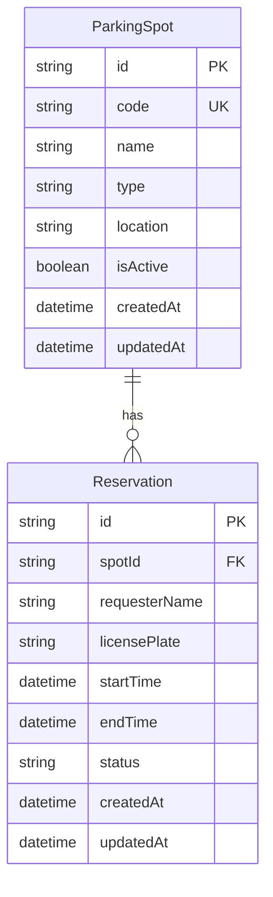

# Parkolóhely-foglalási Rendszer - Rendszerterv

## 1. Áttekintés és Architektúra

A rendszer egy rétegzett RESTful architektúrára épülő backend alkalmazás, amely egy beépített interaktív Web Dashboard-ot és OpenAPI/Swagger felületet is szolgáltat.

### Főbb architekturális rétegek:
1. **Presentation Layer (Megjelenítési réteg):**
   - Single Page Web UI (HTML5, Vanilla CSS glassmorphism dizájn, Aszinkron REST API JS kommunikáció).
   - Swagger UI interaktív API dokumentáció (`/api-docs`).
2. **Controller Layer (Végpont-kezelő réteg):**
   - Express.js routerek és kontrollerek (`spotController`, `reservationController`).
   - Kérés/válasz validáció, HTTP státuszkódok közvetítése.
3. **Service Layer (Üzleti logikai réteg):**
   - Foglalási ütközésvizsgálat (`ReservationService`), tranzakciókezelés.
   - Szabályok: `startTime < endTime`, csak aktív parkolóhely foglalható, időbeli átfedések kiszűrése (`startTime < existing.endTime AND endTime > existing.startTime`).
4. **Data Access & Persistence Layer (Adatréteg):**
   - Prisma ORM (Object-Relational Mapping) SQLite adatbázissal.
   - Atomikus tranzakciók (`prisma.$transaction`) a versenyhelyzetek (race condition) megelőzésére.

---

## 2. Adatbázis Modell (ER-Diagram)

### Adatbázis Indexelés és Teljesítmény:
A foglalási lekérdezések és ütközésvizsgálatok felgyorsítása érdekében összetett index került elhelyezésre a `Reservation` táblán:
`@@index([spotId, startTime, endTime, status])`

---

## 3. Teljesítmény és Skálázhatósági Megfontolások

- **Időbeli ütközésvizsgálat hatékonysága:** Nem memóriában szűrjük le a teljes adatbázist, hanem az adatbázis-kezelő indexét kihasználva célszerű SQL feltételt (`WHERE spotId = X AND status = 'CONFIRMED' AND startTime < end AND endTime > start`) futtatunk.
- **Tranzakciós garancia:** Az ütközésvizsgálat és a rögzítés atomi tranzakcióban történik. Egyidőben beérkező párhuzamos foglalási kérések esetén sem alakulhat ki duplafoglalás.
- **Konténerizáció & Konfiguráció:** Docker felkészített (multi-stage build), amely minimális image méretet és gyors indítást biztosít.

---

## 4. Opcionális Extra Funkciók

- **Parkolóhely Típusok Kezelése:**
  - `STANDARD`: Normál parkolóhely.
  - `EV_CHARGING`: Elektromos autó töltőállomással ellátott hely (22kW / 50kW Fast).
  - `HANDICAPPED`: Mozgáskorlátozottak számára fenntartott hely.
  - `VIP`: Vezetői/VIP parkolóhely.
